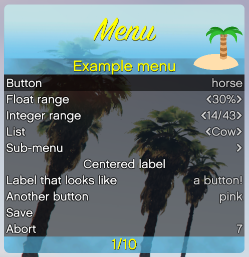

# Paradise Menu #

This is a useless resource for end-users. It is intended for developers of [FiveM](http://fivem.org) resource, to aid them in providing half way decent menus to their users.  
If you are not a developer, then this is not meant for you.

## What does it look like, though? ##

The palms in the background are not part of the menu. They just photobombed me when I took the screenshot.  
They do illustrate quite well that the menu is semi-transparent, don't you think?

## Blue? What's with the little island?! ##

Don't worry. With just a tiny bit of experience with [OpenIV](http://openiv.com/), you can make a different skin for it and put your own logo there. It's fine. I won't even cry.  
That island is the logo of the server I wrote this for, [Swedish Paradise](http://gta.z0rz.net/).  
Just bust open the included YTD to see what parts you'll need.  
This whole thing is MIT licensed, so you can even derive your own graphics for mine. Stick to the license and I swear I won't hunt you down with an angry ferret.

## Where do I begin? ##

First, you do the downloading and the `server.cfg` stuff as per usual.

In the `dependencies` section of your `__resource.lua`, add `'paradise-menu'`.  
In the `client_scripts` section, you may add `'@paradise-menu/menu.lua'`, or you can use the available exported function.

Working through exports is really slow, so I do not recommend it.  
If someone could point out what I did wrong to make it this slow, that'd be great.

First, you must obtain a `pMenu` object, and after that the `@lua` method and the exported function method are exactly the same, aside from the horrible slow-downs from the export.  

    -- The @lua way:
    local muhMenu = pMenu({
        header = 'I has a menu'
    })
or

    -- The exports way:
    local muhMenu = exports['paradise-menu]:create({
        header = 'I has a slow'
    })

More on the creation options are [in the example](example.lua).

Before you can draw your menu, you must make it visible.

    -- As promised, exact same for both ways.
    muhMenu.show()

Now you're ready to draw your menu, but .. what's in it? What menu items do you want?  
First we'll need some menu callbacks, though. Go get some coffee, because this is where it gets convoluted and user-hostile.

## What are menu callbacks? ##

An integral part of `paradise-menu` is the concept of a menu callback. This is a function that the menu will call when it thinks it's relevant, even if you disagree. Try not to cry, you'll figure out what I mean eventually.

    function buttonCallback(selected,value,menu)
        if selected then
            Citizen.Trace('You selected a button! It has the value '..value)

            -- Because a value is passed, a single callback function can do more than one thing!
            if value == 'close' then
                menu.hide()
            end
        end
    end

So far, so good. It's just a function.  
This one is suitable to be called by a button, as it takes just three arguments.  
What if there is a list in the menu, though?

Yes, I'm aware that pineapples are not animals, but that is hardly relevant to the task at hand. Pay attention!

    local selectedAnimal = 1
    local animals = {"Cow","Horse","Dog","Pineapple"}

    function animalCallback(selected,newIndex,data,menu)
        if selected then
            -- Whatever cod you put here will run when the item is *selected*
        else
            -- This will run when the item is *changed*, for example, if the value was increased...
            selectedAnimal = newIndex
            -- ...will now indicate that we care more about the horse than the cow.
        end
    end

Excellent, now we have the ground work laid down, and can begin drawing our menu!

## How do I draw the menu? ##

Since the menu is entirely dynamic, we can build the menu when we draw it. For very heavy menus, however, it's recommended that you build it ahead of time, and then rebuild it when appropriate. For example, we could rebuild the menu from the callback functions.

    muhMenu.draw({
        'Finally!',{ -- This is our "root level"
            -- This is where our root level menu items go!

            {'Button!','description','some value',buttonCallback},
            -- Note that we are not calling the callback function, only referring to it!

            {'Select animal', animals,selectedAnimal,animalCallback,'animal selection'},
            -- See how this ties in with the stuff we set up before? No?
            -- TODO:  Improve documentation.

            {'Close menu','','close',buttonCallback}
            -- The description bit on the right side of the button can be blank. No worries.
        }
    })

## It doesn't draw! ##

Maybe it blinks once on screen, and then it's gone?  
You have to draw it *every frame*, or it won't be even remotely useful.
Let's do a complete example:

    local selectedAnimal = 1
    local animals = {"Cow","Horse","Dog","Pineapple"}

    function animalCallback(selected,newIndex,data,menu)
        if selected then
            Citizen.Trace('Selected animal: '..animals[newIndex])
        else
            selectedAnimal = newIndex
        end
    end

    function buttonCallback(selected,value,menu)
        if selected then
            Citizen.Trace('You selected a button! It has the value '..value)
            if value == 'close' then
                menu.hide()
            end
        end
    end

    local muhMenu = pMenu({header = 'muh Menu!'})

    Citizen.CreateThread(function()
        local muhMenu
        while true do
            if muhMenu.visible() then
                muhMenu.draw({
                    'Finally!',{
                        {'Button!','description','some value',buttonCallback},
                        {'Select animal', animals,selectedAnimal,animalCallback,'animal selection'},
                        {'Close menu','','close',buttonCallback}
                    }
                })
            elseif IsControlJustPressed(0,244) then -- INPUT_INTERACTION_MENU, usually bound to M
                muhMenu.show()
            end
            Citizen.Wait(0)
        end
    end)

## Neat! How do I use the menu? ##

Assuming you're reasonably close to the default bindings, it uses the arrow keys for up and down, increase and decrease.  
Selection is done with the Enter key and going up a level from a sub menu is done with backspace.  
If the menu is configured to be abortable, backspace also closes the menu when you're at root level.

## Sub menus, you say? ##

Yes, I was getting to that. A sub-menu is like a menu *inside* a menu.  
Let's work off what we already have, and see where it gets us.

    muhMenu.draw({
        'Finally!',{
            {'Button!','description','some value',buttonCallback},
            {'Select animal', animals,selectedAnimal,animalCallback,'animal selection'},
            {'Abort mission!'{
                {'For real!','','close',buttonCallback}
            }}
        }
    })

See what we did there? Now "Abort mission!" is a sub menu, and it has the button "For real!" in it.  
Yes, I know it's the same button as before, but with a new name, but that's the whole idea. You could change this table on the fly as much as you like, and you can go as deep in sub menus as your RAM will hold in one gulp.

## What menu item types are there? ##

There are labels, buttons, lists and ranges.  
Labels have two flavours:  Centered and button-like.  
Ranges also have two variants:  Integer and float.

To see what they all look like, I suggest having a look at [the provided example](example.lua).  
It's really important that all the fields are present in all the menu items, as that's how `paradise-menu` knows which is which. Not very user friendly, I know, but it makes for a much more dynamic menu than having to decleare everything before drawing.  
Yes, it also means that it's more prone to *straight up crashing*, but we're all programmers here, and can deal with it.  
Right?

## What functions can I call, and what do they do? ##

|Functon     | Thing what it does                                                       |
|------------|--------------------------------------------------------------------------|
| .show()    | Shows the menu                                                           |
| .hide()    | Hides the menu                                                           |
| .visible() | Returns if the menu is visible or not                                    |
| .disable() | Makes the menu non-interactive and slightly more transparent             |
| .enable()  | Makes it interactive again, regular transparency                         |
| .root()    | Sends the menu back to the root level and makes the first item selected  |
| .draw()    | Makes you dinner an.. Oh, wait, it draws the menu                        |

## What now? ##

Now you fork this project, fix all my bugs and send a pull request.  
Congratulations on your fresh headache.